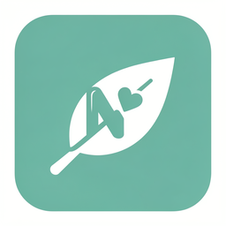

# NutriCoach — Gestione Nutrizione per Nutrizionisti

**Gestionale di nutrizione per nutrizionisti, locale, che chiude il loop tra piano alimentare, misure del corpo (BIA/antropometria) e follow-up del cliente — con diario, pianificazione automatica, appuntamenti e notifiche. Tutto offline.**

   

Latest: **[v2.9.0 — Template dieta personalizzabili + UI migliorata](https://github.com/quadrellif90-collab/NutriCoach/releases/tag/v2.9.0)**

> 🔒 **100% offline.** Nessun dato lascia la macchina. Nessun account remoto. Nessuna sottoscrizione. I dati dei tuoi clienti vivono solo in `~/.nutricoach/` sul tuo computer.

---

## TL;DR

NutriCoach v2 è un gestionale **localhost-only** stile Dietowin/Nutrium che include:

- **Database alimentare professionale** (212 alimenti INRAN/CREA, 11 categorie, valori nutrizionali completi: kcal, proteine, carboidrati, grassi, fibre, zuccheri, sale)
- **Diario alimentare** con ricerca autocomplete e calcolo macro automatico
- **Piani alimentari** generati automaticamente per protocollo (Mediterranea, Zona, Keto, Vegano, CKD, Carb Cycling...)
- **Export PDF professionale** del piano con brand, macro giornalieri, raccomandazioni
- **Calcolo fabbisogno energetico** (Mifflin-St Jeor, Harris-Benedict, Katch-McArdle) con TDEE e target per obiettivo
- **Lista della spesa automatica** dal piano (aggregata per alimento e per categoria) + export PDF
- **BIA & Antropometria** con OCR integrato (Windows.Media.Ocr, 14/14 campi da PDF AKERN) e grafici evolutivi multi-metrica
- **Portale paziente** (vista read-only via link protetto con token)
- **Backup automatico** giornaliero + export/import JSON/CSV
- **Template dieta personalizzabili** e **tema chiaro/scuro**

Tutti i calcoli derivano da **un solo motore**: diario, piano, lista spesa e PDF sono *viste* coerenti, mai numeri discordanti.

---

## 🚀 Novità v2.x (8 capitoli completati)

| Ver | Capitolo | Funzionalità chiave |
|-----|----------|---------------------|
| **v2.1.0** | OCR Engine | Windows.Media.Ocr embedded (nessuna dipendenza), 14/14 campi BIA da PDF |
| **v2.2.0** | Database alimenti | 212 alimenti, 11 categorie, ricerca, valori completi |
| **v2.3.0** | Export PDF piano | Tabella 7×5, macro giornalieri, raccomandazioni, alimenti esclusi |
| **v2.4.0** | Fabbisogno calorico | Mifflin/Harris/Katch-McArdle, TDEE, target per obiettivo |
| **v2.5.0** | Lista spesa | Aggregazione grammature, raggruppamento per categoria, PDF |
| **v2.6.0** | Grafici evolutivi | 7 metriche BIA, sparkline SVG + report PDF |
| **v2.7.0** | Portale paziente | Vista read-only protetta da token, mobile-friendly |
| **v2.8.0** | Backup + export | Backup giornaliero auto, CSV/JSON, import paziente |
| **v2.9.0** | Template + UI | Template dieta riusabili, tema scuro/chiaro |

---

## Avvio rapido

```bash
# Clona e installa
git clone https://github.com/quadrellif90-collab/NutriCoach.git
cd NutriCoach
pip install -r requirements.txt

# Avvia (Windows)
python run_v2.py
# oppure con porta personalizzata
python run_v2.py 8400
```

Apri `http://127.0.0.1:8400` nel browser.

**Build EXE:** `python build_exe.py` (PyInstaller) → `dist/NutriCoach.exe`

---

## Database alimentare

`nutrition_db.py` contiene 212 alimenti italiani (fonte INRAN/CREA) con valori per 100g:
- kcal, proteine, carboidrati, grassi, fibre, zuccheri, sale
- 11 categorie: latticini, carni, pesce, cereali, legumi, verdure, frutta, frutta secca, olii grassi, bevande, varie

La tabella `food_catalog` viene popolata automaticamente al primo avvio (migrazione automatica per DB esistenti).

---

## Motore BIA & OCR

`app/ocr_engine.py` utilizza **Windows.Media.Ocr** (API nativa Windows 10/11, italiano) per estrarre i valori dai referti PDF AKERN/InBody:
- Rende il PDF in immagini (PyMuPDF)
- Estrae il testo con coordinate
- Parsa la tabella "Risultati" in sequenza
- Mappa 14 campi: peso, altezza, BMI, FM, BF%, FFM, TBW, ECW, ICW, BCM, SMM, ASMM, PhA, Idratazione
- Fallback su Tesseract se `winsdk` non è disponibile

---

## Calcolo fabbisogno (v2.4.0)

`app/energy_calc.py`:
- **Mifflin-St Jeor**: `10·kg + 6.25·cm − 5·età + (5 M / −161 F)`
- **Harris-Benedict** (rivista)
- **Katch-McArdle**: `370 + 21.6·LBM` (se BF% nota)
- **TDEE** = BMR × fattore attività
- **Target kcal** = TDEE ± obiettivo (dimagrimento −15%, massa +10%, performance +5%)

---

## Portale paziente (v2.7.0)

Genera un link protetto (`/api/patients/{pid}/portal-token`) che il paziente può aprire per vedere il proprio piano alimentare in formato mobile-friendly. Il token è opaco (secrets.token_urlsafe) e i dati sensibili non vengono esposti.

---

## Backup & Export (v2.8.0)

- **Backup automatico** giornaliero in `~/.nutricoach/backups/` (copia DB + dump JSON)
- **Export CSV** di tutti i pazienti
- **Export/Import JSON** di un singolo paziente (BIA, dieta, appuntamenti, documenti)

---

## Architettura

```
NutriCoach/
├── app/
│   ├── main.py          # FastAPI app + tutte le route API
│   ├── database.py      # SQLite, migrazioni automatiche
│   ├── diet_pdf.py      # Generazione PDF (piano, spesa, report BIA)
│   ├── energy_calc.py   # Fabbisogno calorico
│   ├── ocr_engine.py    # OCR Windows.Media.Ocr + fallback Tesseract
│   ├── templates/
│   │   ├── index.html   # UI principale (Dietowin-style)
│   │   └── portal.html  # Portale paziente read-only
│   ├── static/style.css # CSS con tema chiaro/scuro
│   ├── diet_presets.py  # Protocolli dietetici
│   └── ...
├── nutrition_db.py      # Database alimenti (INRAN/CREA)
├── run_v2.py            # Avvio server
└── build_exe.py         # Build PyInstaller
```

---

## Licenza

MIT — vedi [LICENSE](LICENSE).
